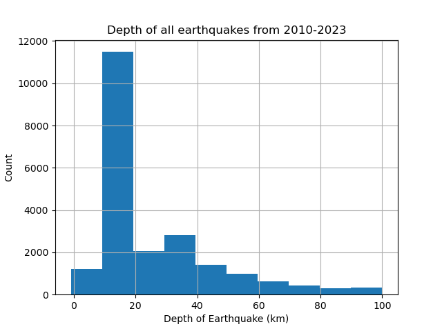
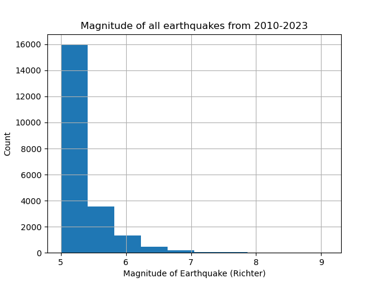
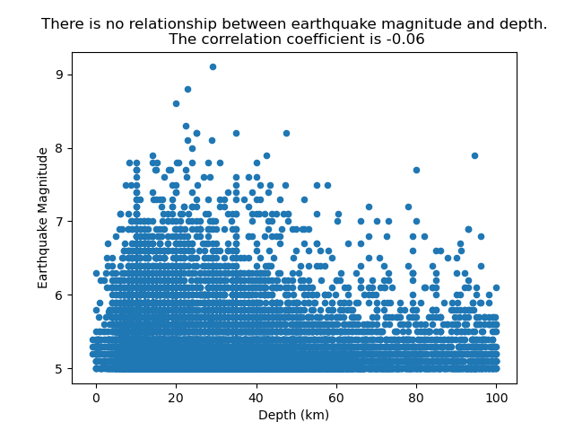
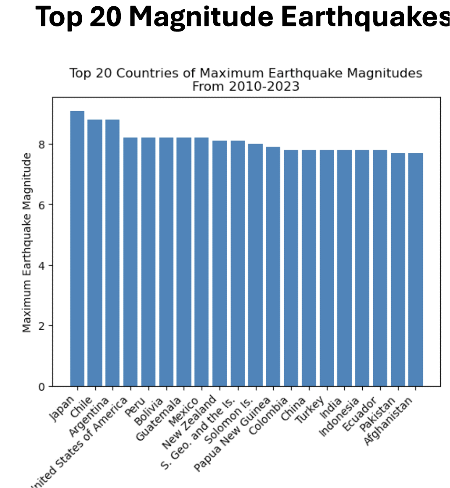
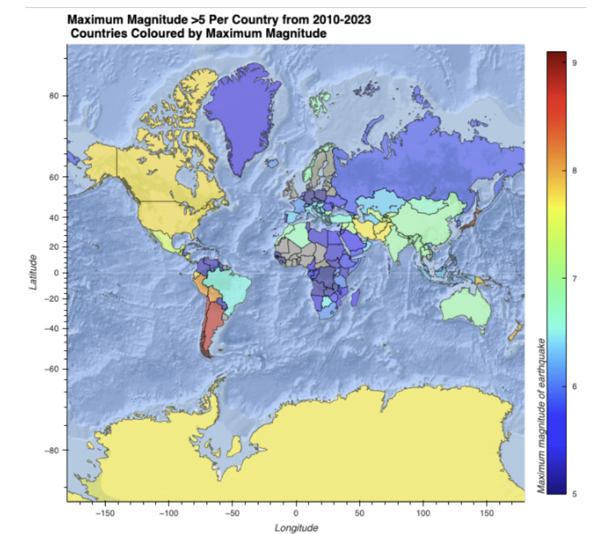
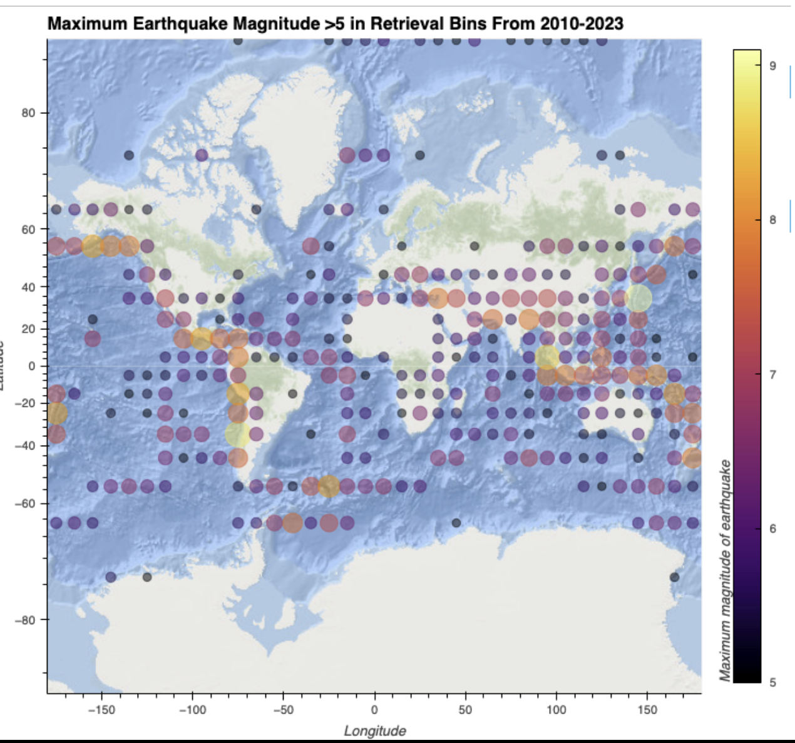
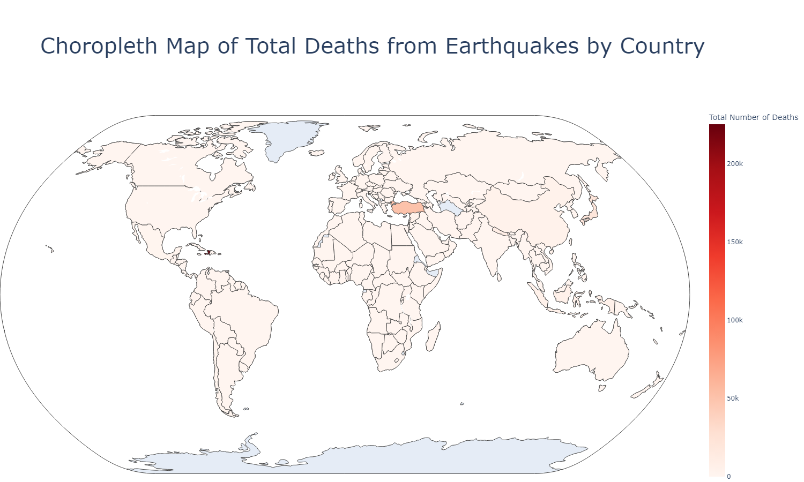
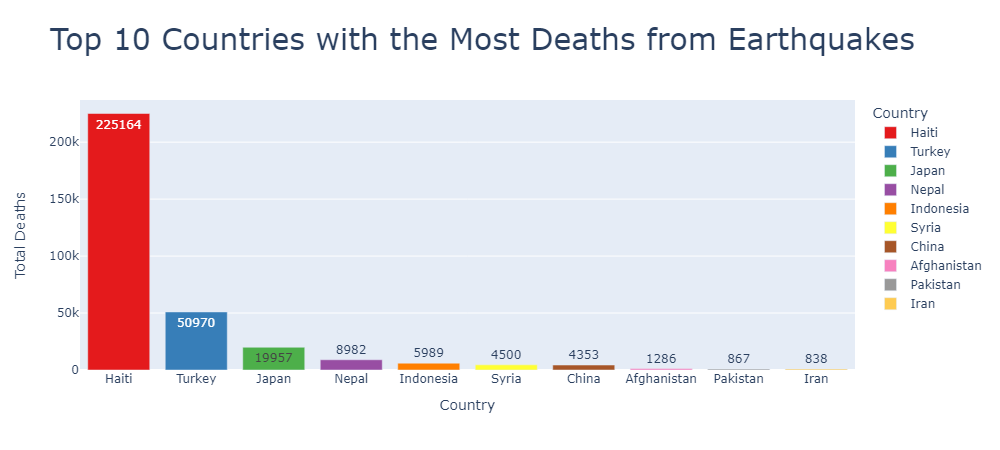
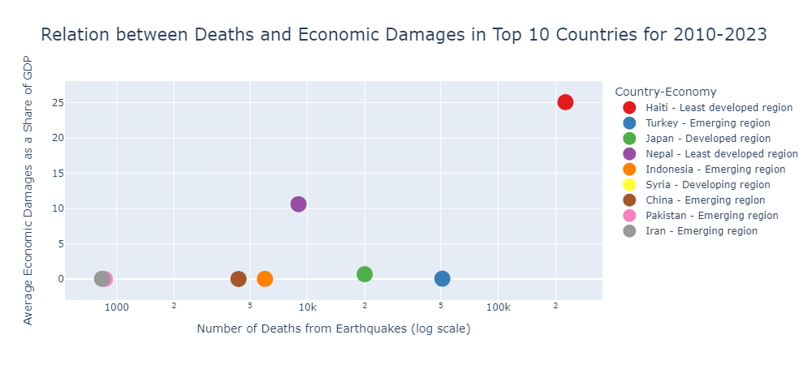

# Earthquakes of 2010-2023
Analytics Bootcamp Project 1 Group 6

## Contributors
* Hazel 
* Ashrita
* Richard
* Ben

## List of Proposed Questions
When we were initially brainstorming ideas for this project, we came up with the following questions to investigate.

1.	Successfully retrieve earthquake data from various open API sources 
2.	Look at the distribution and spatial characteristics of the magnitudes of earthquakes. Is there any correlation between earthquake magnitude and depth? 
3.	Record the number of earthquakes across different countries and globally. Rank these countries by the number of earthquakes and through time. Analyse the spatial distribution of the number of earthquakes. 
4.	Investigate the frequency of earthquakes per month and year. Analyse this spatially
5.	Investigate what are the relationships between magnitude of earthquake and causality rates and determine which countries are most affected. Is there a relationship between causality rates and a countries economic status? 
6.	*Stretch Question*: Is it possible to correlate tidal fluctuations with earthquake occurrence?

## Sources of Data
- Earthquake data: https://earthquake.usgs.gov/fdsnws/event/1/
- Earthquake death toll data: https://ourworldindata.org/natural-disasters
- Country shape files for country polygons and country metadata on GDP and economic status: https://www.naturalearthdata.com/downloads/10m-cultural-vectors/10m-admin-0-countries/

## Setup
It is strongly recommended to use the conda-forge channel with `conda config --add channels conda-forge`.

To run the notebooks in this project please use the yaml file `environment_requirements.yaml` for install with the command `conda env create -f environment_requirements.yml`. 

# Analysis of Data

## Data Retrieval

### Earthquake Data Retrieval Through USGS API  

The scripts used in the earthquake data retrieval are found in the notebook `generate_dataset.ipynb`. 

### Viewing Data

Combining the monthly earthquake outputs in csv file outputs from the USGS data retrieval are found

## Assumptions and Filters
To reduce the size of the dataset, we’ve needed to filter out earthquakes from the data retrieval. We used the following:
- restricting earthquake magnitude to greater or equal to 5 
- retrieving data from 2010-2023
- filtering out earthquakes with a recorded depth of greater than 100km

## Analysis of Earthquake counts Per Country

## Analysis of Earthquake Magnitude and Depth

Most of earthquakes from 2010 to 2023 are between 5 and 6 magnitude
Most frequent occurrence of earthquakes between 2010 and 2023 are in a depth of below 20 km.​ Earthquakes with the depth of 20 and 40 km and 40 and 60 km occurred less.

 There is no significant relationship between earthquake magnitude and depth since the correlation coefficient is -0.06.

 

 # Analysis of Earthquake magnitudes

 Ranking magnitudes by top 20 countries are displayed.

 

 They are in accordance with the maps of most maximum magnitude earthquakes.

 

 

 ## Earthquake Casualty Analysis by Country

This repository contains visualisations based on earthquake data, focusing on the impact of earthquakes on human lives and economic damages. The visualisations cover the period from 2010 to 2023.

### Choropleth Map: Total Deaths by Country

The choropleth map displays the total number of deaths caused by earthquakes in different countries. The colour intensity represents the magnitude of the impact.

 

### Top 10 Countries with the Most Deaths from Earthquakes

A bar chart illustrating the top 10 countries with the highest number of deaths from earthquakes during the specified period. Each bar represents the total deaths in a country.

 

### Relation between Deaths, Economic Damages, and Economic Status in Top 10 Countries

A scatter plot illustrating the relationship between the number of deaths and the total economic damages caused by earthquakes as a share of GDP in the top 10 affected countries.

 

**Note:** Economic status is categorised and noted next to the country's name for better understanding. The data used for this visualisation is based on earthquake events recorded from 2010 to 2023.

### People Affected, Deaths, and Death to Affected Ratio in Top 10 Countries

A set of bar charts presenting the total number of deaths, the total number of people affected, and the death-to-affected ratio in the top 10 countries. Each chart provides insights into different aspects of the earthquake impact.

 

**Note:** The data used for these visualisations is based on earthquake events recorded from 2010 to 2023. The analysis aims to provide a comprehensive overview of the human and economic damages of earthquakes during this period.

 ## Summary

### Key Findings
- We were able to successfully use the USGS API interface to retrieve >20000 earthquakes from 2010 to 2023
- We were successfully able to capture the number of earthquakes across different countries. We ranked these countries by the number of earthquakes and through space & time. We also used an extended boundary of countries to catch earthquakes nearby to other countries which could impact that country
- We observed the left skewedness of earthquake magnitude and depth & found that there were no correlations between depth and magnitude
- We observed the spatial distribution of maximum magnitude of earthquakes and ranked countries by largest earthquake magnitude experienced. 
- Effect of earthquakes:
    - We observed the countries that have the highest cumulative causality rates from earthquakes. 
    - We observed that poorly developed nations suffer greatest economic impact from earthquakes. 
    - The death-to-affected ratio may be influenced to a country’s economic status (preparedness). The Japan outlier suggests that the earthquake magnitude also has a role to play
    - 
### Recommendations

